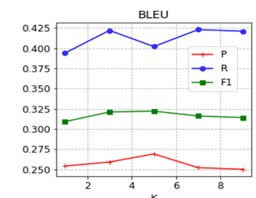
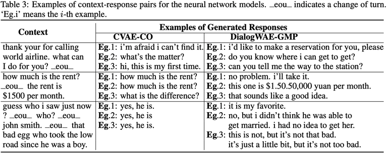

# Project2

## Background

- 工业上的chatbot

  - [ChatterBot](https://chatterbot.readthedocs.io/en/stable/): 一个[Python 聊天机器人框架](https://www.oschina.net/p/chatterbot)：比较输入最相近。对于闲聊型问题还可以回答正确几个，但是对于任务型、知识型问题一窍不通，这应该是开源项目里没有设置相应的模块、语料库资源过少，也不能够主动上网查询。
  - 

  - 

- chatbot的信息 https://blog.csdn.net/m0_37565948/article/details/81582585

- 我们对于chatbot的理解，input对应输出output

## Related Works

- 相关技术（2-3张papers）

  

## Motivation（Optional）

- 

## Technology/Approach

- 网络图结构

## Implementation Details

- 实现细节

## Evaluation

- 对比

  

## Demo

- Example

  

## Task Allocation

- 任务安排

- 蓝浩宁：背景分析和算法研究
- 程可：Transformer算法理解
- 刘慎恒：Baseline代码理解
